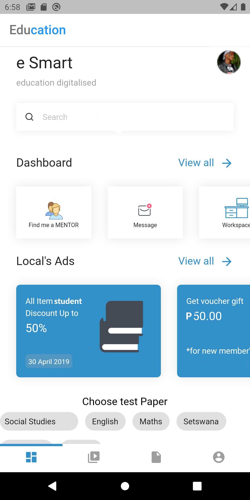

# Flutter Firebase  - The Full Course
 An educational ecosysyem  App from scratch with Flutter & Firebase. 

## To do's

- Create login page
- find me a mentor
- teacher create class
- revision papers section
- display if a user is a student or teacher on a post

## ScreenShots

#Menu

# Create post

# Comment

# TImeline

# Create post 

# Search User

# Profile

# Search Users

# Friends Activity

# Database

- FIrebase Firestore
